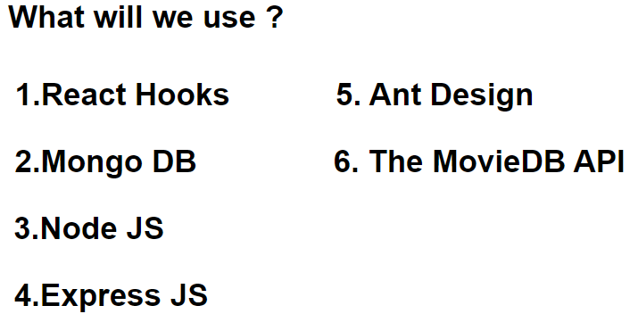

# MovieApp

영화 정보를 제공하고, 사용자 인증 및 즐겨찾기, 댓글, 좋아요/싫어요 등 다양한 기능을 지원하는 React 기반 영화 정보 제공 웹 애플리케이션입니다.

## 주요 기능

- **영화 목록 및 상세 정보**  
	최신 영화 리스트와 각 영화의 상세 정보를 확인할 수 있습니다.

- **회원가입 및 로그인**  
	JWT 기반 인증을 통해 회원가입, 로그인, 로그아웃 기능을 제공합니다.

- **즐겨찾기**  
	사용자는 영화를 즐겨찾기에 추가하거나 삭제할 수 있습니다.

- **댓글 및 답글**  
	영화 상세 페이지에서 댓글 작성, 답글, 삭제가 가능합니다.

- **좋아요/싫어요**  
	영화 및 댓글에 좋아요/싫어요를 표시할 수 있습니다.

- **반응형 UI**  
	다양한 화면 크기에 맞춰 최적화된 레이아웃을 제공합니다.

## 기술 스택

- **Frontend**  
	- React  
	- Ant Design  
	- React Icons  
	- Axios

- **Backend**  
	- Node.js  
	- Express  
	- MongoDB (Mongoose)

- **기타**  
	- JWT 인증  
	- RESTful API  
	- Proxy 설정

## 폴더 구조

```
client/
	src/
		components/
			views/
				LandingPage/
				LoginPage/
				RegisterPage/
				MovieDetail/
				FavoritePage/
				NavBar/
				Footer/
				commons/
		_actions/
		_reducers/
		assets/
		hoc/
		...
server/
	models/
	routes/
	middleware/
	config/
	...
```

## 시작 방법

1. **의존성 설치**
	 ```bash
	 npm install
	 cd client
	 npm install
	 ```

2. **서버 실행**
	 ```bash
	 npm start
     npm run dev
	 ```

3. **클라이언트 실행**
	 ```bash
	 cd client
	 npm start
	 ```



위 이미지는 제가 사용한 기술 스탯들입니다.

## 라이선스

본 프로젝트는 학습 및 개인용으로 자유롭게 사용할 수 있습니다.
